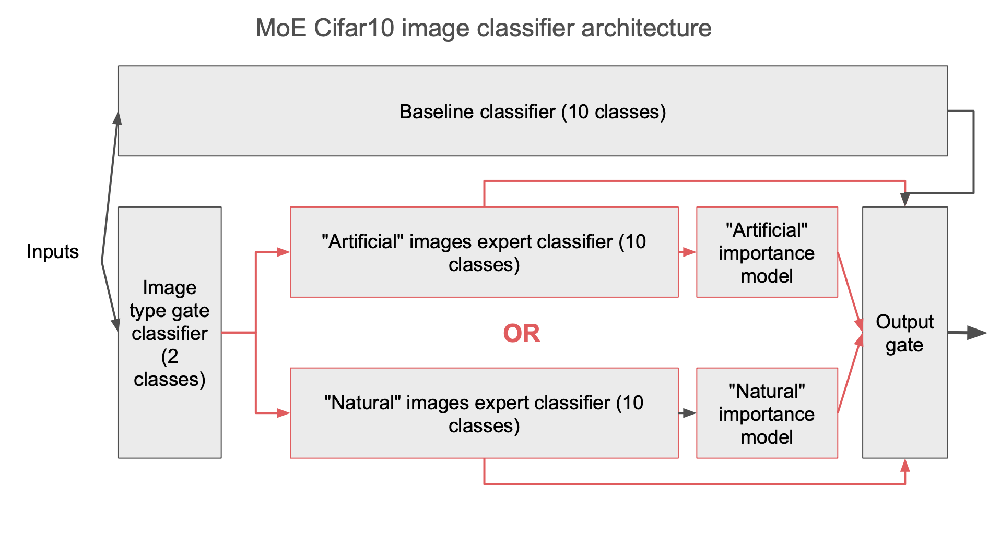

# 2-MIXTURE-OF-EXPERTS

## Using GitHub
If this is your first time using GitHub, it would be useful to complete the _Git & GitHub Fundamentals_ assignment at https://classroom.github.com/a/c5Me39XH.
This assignment illustrates the basic functionalities of GitHub and how to work with them.

## Introduction

Mixture of experts (MoE) is a machine learning technique where multiple expert Neural Networks are used to divide a problem space into homogeneous regions. In this lab, we will use MoE in a classification task on [Cifar10](https://www.cs.toronto.edu/~kriz/cifar.html).

We will train a gating function to detect wether images are "natural images" (e.g. cat, dog, etc) or "artificial images" (e.g. plane, car). This gating functions will direct the samples to two deferent "expert" classifers, one trained to classify within the natural images catergory, and the other trained to classify within the artificial images catergory. Fianly, these experts will then used to boost the performance of a baseline 10 classes classiers.

All models (gating function, experts, and baseline classifers) will be [Convolutional Neural Networks (CNNs)](https://en.wikipedia.org/wiki/Convolutional_neural_network), a variant of the Multi Layers Perceptron (MLP) seen in lab 1 that uses [Convolutional layers](https://en.wikipedia.org/wiki/Convolutional_layer) and [Pooling layers](https://en.wikipedia.org/wiki/Pooling_layer) to automate feature extraction.

## Intended Learning Outcomes
* Define and train Convolutional Neural Networks with Tensorflow Keras.
* Use Layers and Wrappers to define and combine custom gate models.
* Compare the performances of a simple CNN classifier with a MoE classifier.

## Instructions
* Make sure you have completed the setup assignment (link on Moodle). 
* Complete all the tasks in `2-mixture-of-experts.ipynb`.
* When finished, merge the Pull Request created by GitHub Classroom.

> [!CAUTION]
> This action is not reversible, do NOT merge until you are sure that you are satisfied with your work.

* When released on Moodle, use the solution password to unzip `2-mixture-of-experts-solutions.zip` and compare with your work.
