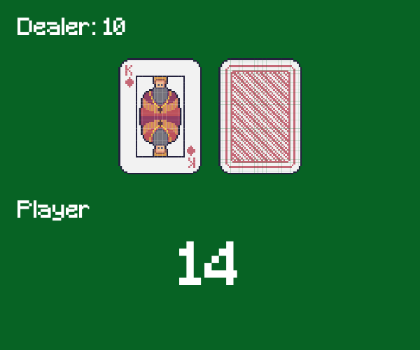

# 3-REINFORCEMENT-LEARNING

## Using GitHub
If this is your first time using GitHub, it would be useful to complete the _Git & GitHub Fundamentals_ assignment at https://classroom.github.com/a/c5Me39XH.
This assignment illustrates the basic functionalities of GitHub and how to work with them.

## Introduction

Reinforcement Learning (RL) is a type of machine learning where an agent learns to make decisions by interacting with its environment. Through trial and error, the agent observes the outcomes of its actions and gradually learns to take optimal actions to maximize long-term rewards. RL is widely used in areas such as game AI, robotics, and recommendation systems, making it a fundamental tool for building intelligent systems.

In this lab, you will use **Gymnasium**, a widely used RL library, to train different types of models to play **Blackjack**, a classic card game of decision-making under uncertainty. You will explore various RL approaches, from **tabular Q-learning** to **Deep Q Networks (DQN) with Experience Replay**, and observe how different training strategies affect the agent's performance. Through Gymnasium’s Blackjack environment, you will gain hands-on experience in defining states, actions, and rewards in a real-world game setting.

By the end of this lab, you will have a solid understanding of reinforcement learning principles and practical experience in training RL agents using **Gymnasium**. You will also compare different RL models and analyze their effectiveness in learning Blackjack strategies.

## Intended Learning Outcome
* Understand what the core components of a Gymnasium Reinforcement Learning environment.
* Implement TD Learning with an epsilon greedy policy on a tabular agent.
* Implement TD Learning with an epsilon greedy policy on a Deep Q-Network (DQN) agent.
* Realise the importance of vectorisation for efficient learning.
* Implement experience replay to improve the DQN agent.
* Implement double-DQN to improve the DQN agent.

## Instructions
* Make sure you have completed the setup assignment (link on Moodle). 
* Complete all the tasks in `3-reinforcement-learning.ipynb`.
* When finished, merge the Pull Request created by GitHub Classroom.

> [!CAUTION]
> This action is not reversible, do NOT merge until you are sure that you are satisfied with your work.

* When released on Moodle, use the solution password to unzip `3-reinforcement-learning-solutions.zip` and compare with your work.